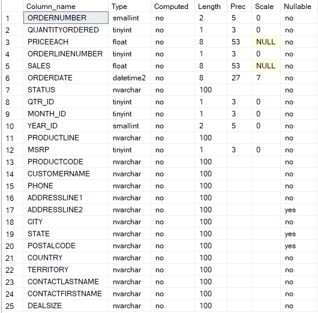
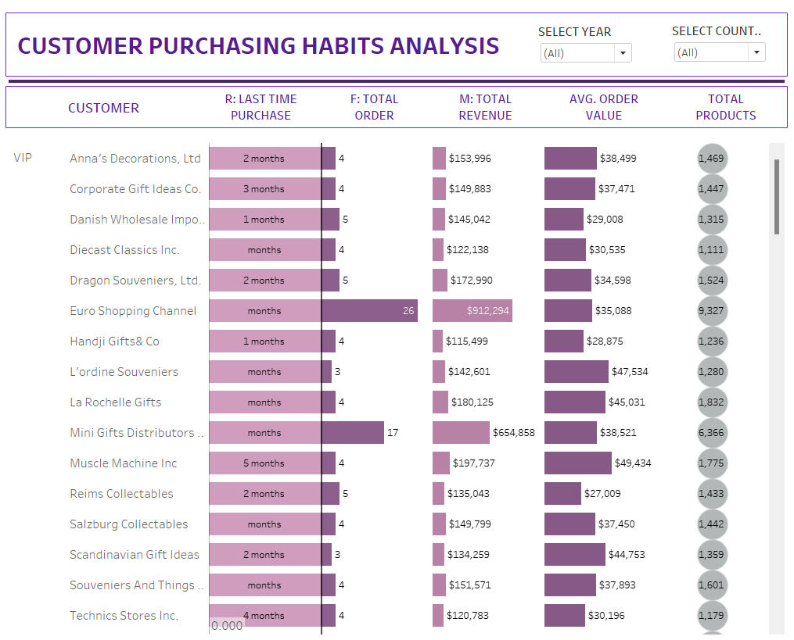

# Project Background

The company that I worked with here is a company that operates in the global logistics and transportation industry, specializing in the sale and shipment of various vehicles, including cars, ships, and motorcycles. It has been in business for over a decade, steadily establishing itsleves as a reliable partner for both individual consumers and businesses seeking to transport goods across international borders.

Marketing department wants to know more about the customer base by segmenting them according to their purchasing behavior. They want to tailor their marketing strategies, improve customer retention, and increase sales by focusing on high-value customers and re-engaging less active ones.

## Key pain point?
- Lack of targeted marketing: Without clear segmentation, marketing efforts are often broad and less effective, leading to missed opportunities for personalized customer engagement.
- Customer churn: Difficulty in identifying at-risk customers who are likely to stop purchasing, resulting in higher churn rates.
  
## Insights and recommendations are provided on the following key areas:
- Recency, Frequency, Monetary (RFM) Scores: These scores allow us to classify customers based on their purchasing behavior, helping to identify segments for targeted marketing.

  - Recency: How recently a customer made a purchase.
  - Frequency: How often a customer makes a purchase.
  - Monetary: How much money a customer spends on purchases.

An interactive Tableau dashboard used to report and explore sales trends can be found here: [Tableau](https://public.tableau.com/views/RFMAnalysis_17248724679780/RFMDashboard?:language=en-US&publish=yes&:sid=&:redirect=auth&:display_count=n&:origin=viz_share_link).

## Data Structure & Initial Checks

# Executive Summary

## Overview of Findings

To address those key pain points mentioned earlier, RFM (Recency, Frequency, Monetary) analysis was conducted. 

Customers are categorized into groups based on their RFM score.

## Insights Deep Dive

### Customer Recency and Frequency:

  - The Recency column (R) tells us how recently each customer made a purchase. Customers with a score of 1 or 2 months are still engaged, while those with higher numbers might need re-engagement. For example, Muscle Machine Inc hasn’t purchased in 5 months, which could signal potential churn.
  - The Frequency column (F) shows how often a customer orders. High-frequency customers like Euro Shopping Channel (26 orders) or Mini Gifts Distributors (17 orders) are highly valuable and should be prioritized for retention.

### High-Value Customers:

  - Customers like Euro Shopping Channel and Mini Gifts Distributors stand out in terms of total revenue, contributing $912,294 and $654,858, respectively. These customers should be given special attention, as they generate significant revenue.
  - The average order value also reveals which customers make larger purchases each time. For example, L'ordine Souveniers has an average order value of $47,534, which is quite high compared to others. This information is crucial for offering tailored deals or upselling.
   
### Customer Segmentation

  - the customers are divided into groups where there are VIPs, Potential Loyalist, Promising, Cannot Lose, Slipping Away and Hibernating. 
  - Segmentation helps in tailoring marketing strategies.

## Recommendation

Based on the insights derived from RFM analysis, here are strategic recommendations:

1. Tailored Marketing Campaigns: Customers like Euro Shopping Channel and Mini Gifts Distributors, who have both high Monetary Value (M) and high Frequency (F), should be considered for VIP or loyalty programs. Develop personalized email campaigns targeting high-value customers with exclusive offers, while creating re-engagement strategies for at-risk customers.

2. Cross-Sell and Upsell to High-Frequency Buyers:
For customers with high Frequency (F) but relatively lower Monetary Value (M), such as Handji Gifts & Co, there may be an opportunity to increase their Average Order Value (AOV) through upselling or cross-selling. Personalized recommendations or bundle offers could encourage them to spend more per purchase.

3. Evaluate Customer Lifetime Value (CLV)
Incorporate a Customer Lifetime Value (CLV) analysis to better understand the long-term value each customer brings. Given that this business involves handling durable goods and high-value transactions, each customer relationship extremely valuable. CLV can help prioritize which customers to invest in for retention and nurturing, especially those with high CLV but declining engagement

# Conclusion

Ultimately, the RFM segmentation enabled the company to make data-driven decisions, leading to improved customer relationships and a measurable impact on sales performance
